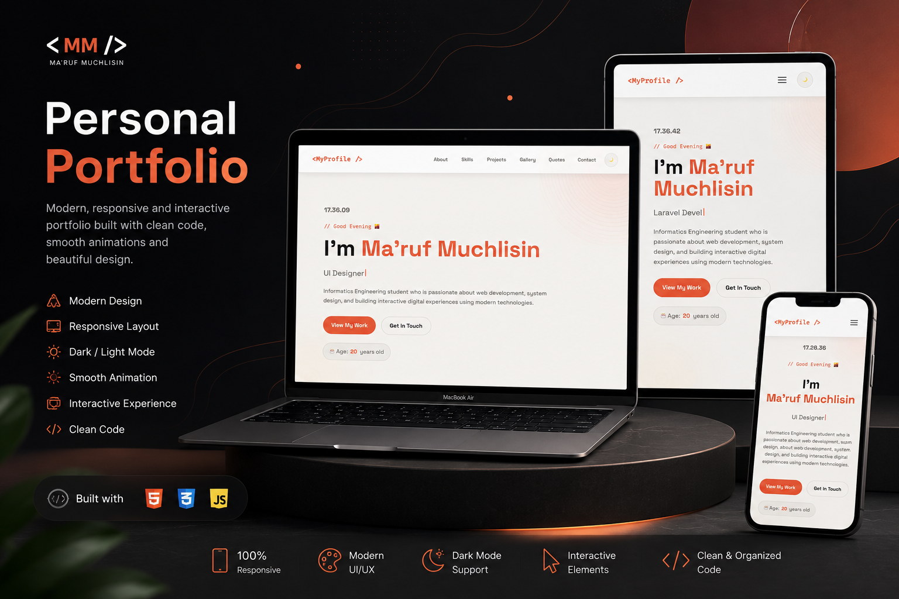

# 🚀 Ma'ruf Muchlisin Portfolio

Modern interactive portfolio website built using HTML, CSS, and JavaScript with smooth animations, dark mode, responsive design, dynamic API integration, and modern UI experience.

---

# 🖥️ Preview



---

# ✨ Features

## 🎨 Modern UI Design
- Clean and modern layout
- Responsive for desktop & mobile
- Glassmorphism navbar
- Smooth hover interactions
- Dark / Light mode toggle

---

## ⚡ Interactive Experience
- Typing animation
- Live digital clock
- Scroll reveal animations
- Animated statistics counter
- Skill progress animation
- Dynamic active navigation

---

## 📸 Creative Gallery
- Responsive image gallery
- Hover zoom effect
- Modern masonry layout

---

## 🔥 Dynamic Content
- Random quote generator using Fetch API
- API integration with external source
- Dynamic footer year
- Real-time greeting system

---

## 📬 Contact Section
- Interactive contact form
- Form validation
- Error handling
- Success message animation

---

# 🛠️ Technologies Used

| Technology | Description |
|---|---|
| HTML5 | Structure |
| CSS3 | Styling & Animation |
| JavaScript | Interactivity |
| Fetch API | External API Request |
| Google Fonts | Typography |

---

# 🎬 Animations Included

- Fade In
- Slide Left
- Slide Right
- Slide Up
- Floating Animation
- Hover Glow
- Smooth Reveal on Scroll
- Loader Animation

Because static websites feel emotionally abandoned.

---

# 📱 Responsive Design

This website is fully optimized for:

- Desktop 💻
- Tablet 📲
- Mobile 📱

Including:
- horizontal mobile navbar scrolling,
- responsive gallery layout,
- adaptive typography,
- optimized spacing.

Humans insist on opening websites from every screen size imaginable. So responsive design became mandatory civilization infrastructure.

---

# 🌙 Dark Mode

Built-in dark mode with:
- localStorage persistence,
- smooth theme transition,
- modern dark palette.

---

# 🔗 API Integration

This project uses external API:

```bash
https://dummyjson.com/quotes/random
```

Used for:
- dynamic quote generation,
- Fetch API implementation,
- asynchronous data rendering.

---

# 📂 Project Structure

```bash
project/
│
├── index.html
│
├── assets/
│   ├── css/
│   │   └── styles.css
│   │
│   ├── js/
│   │   └── profile.js
│   │
│   └── mockup/
│       ├── Macbook.png
│       ├── Iphone.png
│       └── iPad.png
│
└── README.md
```

---

# 🚀 Getting Started

## 1. Clone Repository

```bash
git clone https://github.com/yourusername/portfolio.git
```

---

## 2. Open Project

Use:
- VS Code
- Live Server Extension

DO NOT open using:

```bash
file://
```

Browsers treat local fetch requests like suspicious underground activity.

---

## 3. Run Project

Open with Live Server:

```bash
http://127.0.0.1:5500
```

---

# 📸 Sections Included

- Hero Section
- About Me
- Skills
- Statistics
- Projects
- Creative Gallery
- Daily Quotes
- Contact Form

---

# 🎯 Purpose

This project was created as:
- Web Development Final Project
- Personal Portfolio Website
- Frontend Practice Project
- Interactive UI Showcase

---

# 🧠 Lessons Learned

During development:
- responsive layouts were improved,
- animations were optimized,
- API handling was implemented,
- UI/UX interactions were enhanced,
- JavaScript DOM manipulation was explored deeply.

And naturally, CSS attempted several acts of rebellion.

---

# 👨‍💻 Author

## Ma'ruf Muchlisin

- Informatics Engineering Student
- Frontend Enthusiast
- Web Developer

📍 Wangon, Banyumas  
📧 muchlisinmaruf@gmail.com

---

# ⭐ Final Notes

This project focuses on:
- modern UI,
- smooth interaction,
- responsive experience,
- clean structure,
- frontend creativity.

Built with curiosity, persistence, and repeated negotiations with browser rendering behavior.
